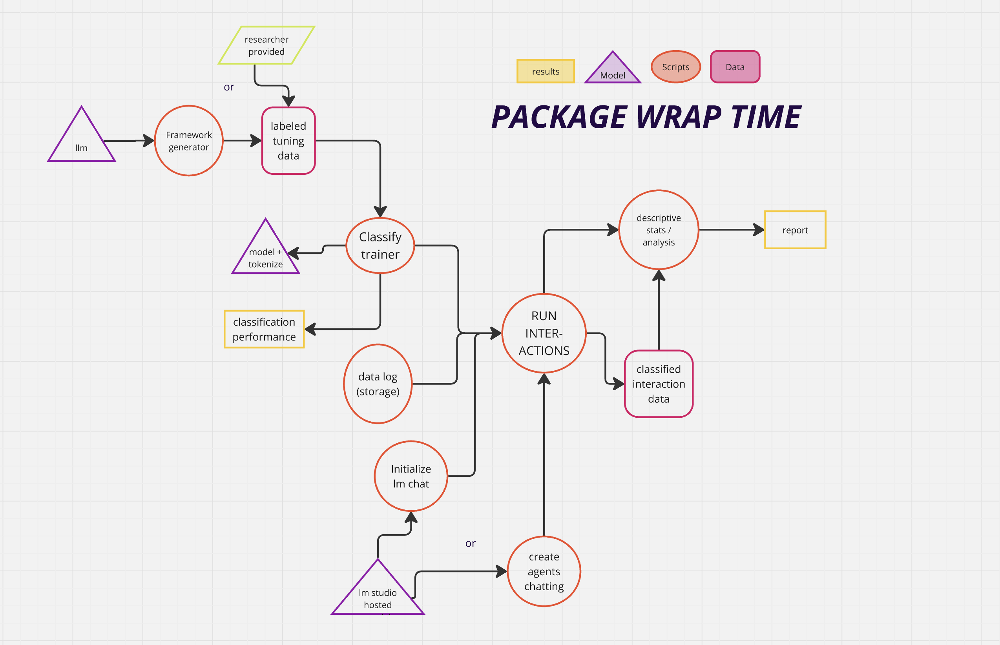

# chat interact wrap eduact :D 
something about this being the repo for my thesis with a niiice outline over how its structured: 
temporary picture of how it may look - mainly for my own overview:



### something about how to run and why 
well first of all because it is a package and not a script to run from the terminal, we see no parser = argparse...
so it is build to be a python package where each function are callable - fingers crossed it will be :D 

# complete overview:
``` 
├── data/                                  # Contains all data assets
│   ├── generated_dialogue_data/           # AI-generated dialogue samples
│   ├── generated_tuning_data/             # Data used for fine-tuning models
│   ├── logged_dialogue_data/              # Logged real or simulated dialogue data
│   ├── tiny_labeled_data.csv              # Small labeled dataset for quick tests
│   └── tiny_labeled_feedback.csv          # Feedback annotations on the tiny dataset
│
├── Models/                                # Folder for storing trained models and checkpoints
│
├── src/                                   # Main source code for all components
│   ├── descriptive_results/               # Scripts and tools for result analysis
│   ├── dialogue_classification/           # Tools and models for dialogue classification
│   ├── dialogue_generation/               # Dialogue generation core logic
│   │   ├── agents/                        # Agent definitions and role behaviors
│   │   ├── models/                        # Model classes and loading mechanisms
│   │   ├── txt_llm_inputs/               # System prompts and structured inputs for LLMs
│   │   ├── chat_instructions.py          # System prompt templates and role definitions
│   │   ├── chat_model_interface.py       # Interface layer for model communication
│   │   └── chat.py                       # Main script for orchestrating chat logic
│   ├── simulate_dialogue.py              # Script to simulate full dialogues between agents
│   ├── dialogue_wrapper/                 # Wraps and manages dialogue pipeline components..
│   ├── framework_generation/             # Framework and outline generation scripts
│   │   ├── outline_prompts/              # Prompt templates for outlines
│   │   ├── old_train_tinylabel.py        # (Deprecated) Classifier training on small dataset
│   │   ├── outline_synth_LMSRIPT.py      # Synthetic outline generation pipeline
│   │   └── train_tinylabel_classifier.py # Training classifier on tiny labeled dataset
│
├── mypythonpackage.py                    # Entrypoint script for the package (if applicable)
├── testing_mypython_package.ipynb        # notebook for testing and demonstration  
├── .python-version                       # Python version file (for pyenv or similar)
├── poetry.lock                           # Locked dependency versions (Poetry)
├── pyproject.toml                        # Main project config and dependencies
``` 