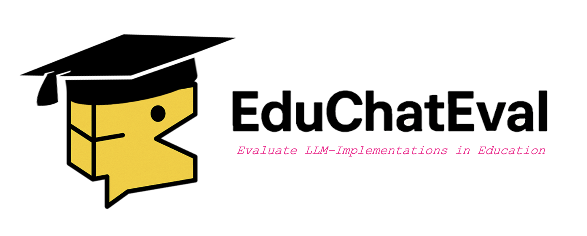

This package provides an evaluation framework for analyzing interactions between students and LLM-based tutors through classification, simulation, and visualization tools.

The package is designed to:

- Provide a customized framework for classification, evaluation, and fine-tuning
- Simulate student–tutor interactions using role-based prompts and seed messages when real data is unavailable
- Initiate an interface with locally hosted, open-source models (e.g., via LM Studio or Hugging Face)
- Log interactions in structured formats (JSON/CSV) for downstream analysis
- Train and applu classifiers to predict customized interaction classes and visualize patterns across conversations

### User Guides and API 
To run the full pipeline, the package requires integration with LM Studio (for local model hosting) and the Hugging Face ecosystem. Step-by-step tutorials are provided in the [User Guide section](user_guides/userguide_intro.md/), covering setup, configuration, and usage across all modules—from data generation to classification and visualization.

Detailed information on the available classes, functions, and configuration options can be found in the [API reference](api/api_frame_gen.md/).

**Be aware**, that the package can be run on python 3.12 due to the dependency on ... 