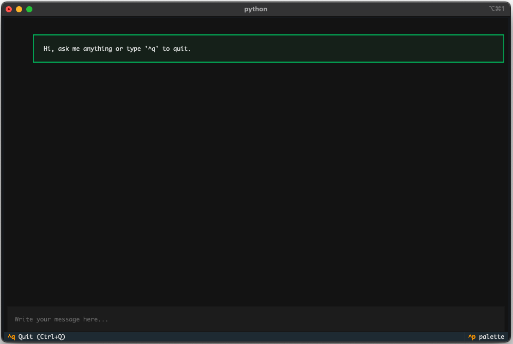

Below are two example workflows demonstrating how to use each module in the package to synthesize, classify, and visualize dialogue interactions between a student and tutor agent. There are two use cases: first for a *feedback* focused scenario, the second for a *intention* focused scenario.  In practice, users are encouraged to incorporate real-world data where available, which may slightly alter certain steps in the pipeline.

## Feedback Example


**Generate Label Framework**

The first example walks through the full pipeline for generating, classifying, and visualizing dialogue interactions focused on different feedback types: (*Advice, Content, Encouragement, Explanation, Posed Question, Small Talk, Specificity*, and *Style*). 

First install the package:
```bash
pip install educhateval
```

Then import the framework generator: 
```python
from educhateval import FrameworkGenerator
```

Initialize the generator with your downloaded and loaded model (`model_name`) and adress of the locally hosted LM Studio API endpoint that handles generation requests (`api_url`), and generate labeled samples. 

```python
generator = FrameworkGenerator(model_name="llama-3.2-3b-instruct", api_url="http://localhost:1234/v1/completions")

# Generating the raw data 
df_feedback = generator.generate_framework(
    prompt_path="/outline_prompts/prompt_feedback.py", 
    num_samples=200, 
    csv_out="/data/labeled_feedback_data.csv"
)

# Filtering based on classifier agreement to ensure high-quality framework
filtered_df = generator.filter_with_classifier(
    train_data="data/tiny_labeled_feedback.csv", 
    synth_data=df_feedback,
    classifier_model_name = "distilbert-base-uncased"
)
```

**Synthesize Interaction**

Import and initialize the dialogue simulator:

```python
from educhateval import DialogueSimulator

# choose either mlx or Huggingface (HF) backend depending on the host of the model
simulator = DialogueSimulator(backend="mlx", model_id="mlx-community/Qwen2.5-7B-Instruct-1M-4bit")
```


In this example a system prompt and seed message is given directly, see [Templates](frameworks.md) for how to structure a `YAML` input instead. 
```python
# making the custom prompt as dict
custom_prompts = {
    "conversation_types": {
        "feedback": {
            "student": "You are a student asking for feedback on your work.",
            "tutor": "You are a helpful tutor providing focused, costructive feedback."
        },
    }
}

# setting prompt and seed msg
prompt = custom_prompts["conversation_types"]["feedback"]
seed_message = "I've written this paragraph, please help me polish it: flowers are nice and they grow in gardens. some are red or yellow. people give them on birthdays and stuff. bees like them too." 

```

In this case the interactions of only one student is simulated. For an example where several student-tutor interactions are simulated and appended to a `DataFrame` look at the intention scenario. 

```python
df_single_feedback = simulator.simulate_dialogue(
    mode="feedback",
    turns=10,
    seed_message_input=seed_message
    system_prompts=prompt
)
```

**Classify and Predict**

Import the classifier and run prediction on the labeled, synthesized data. In this case only the `tutor messages` are of interest, as it is the feedback types provided by the llm that are being analyzed.
```python
from educhateval import PredictLabels

predictor = PredictLabels(model_name="distilbert/distilroberta-base")

# Run the full prediction pipeline
annotaded_feedback = predictor.run_pipeline(
    train_data=filtered_df, 
    new_data=df_single_feedback, 
    text_column="text",
    label_column="category", 
    columns_to_classify=["tutor_msg"], 
    split_ratio=0.25
)
```

**Visualize**

Import the visualizer and plot results:
```python
from educhateval import Visualizer

viz = Visualizer()
```

Generate plots - here focusing on the bar charts:
```python
# Bar plot of class distributions
viz.plot_category_bars(
    df=annotaded_feedback,
    label_columns=["predicted_labels_student_msg", "predicted_labels_tutor_msg"],
    use_percent=True,
    title="Predicted Categories of Feedback",
    palette="twilight"
)
```

Returns:

{ width="400" }

```python
# Trend plot of predicted categories over turns
viz.plot_turn_trends(
    df=annotaded_feedback,
    student_col="predicted_labels_student_msg",
    tutor_col="predicted_labels_tutor_msg",
    title="Categories of Feedback over Turns",
    show_ci=True
)
```
Returns:


{ width="600" }

---

## Intention Example

The second example walks through the full pipeline for generating, classifying, and visualizing dialogue interactions focused on intentions behind messages: (*Clarification*, *Question*, *Small Talk* and *Statement*).

First install the package:
```bash
pip install educhateval
```

**Generate Label Framework**

Import the framework generator:
```python
from educhateval import FrameworkGenerator
```

Initialize the generator with your downloaded and loaded model (`model_name`) and adress of the locally hosted LM Studio API endpoint that handles generation requests (`api_url`), and generate labeled samples. 

In this example a dictionary is provided as prompt. 
See [Templates](frameworks.md) for how to structure a `YAML` prompt input instead. 


```python
generator = FrameworkGenerator(model_name="llama-3.2-3b-instruct", api_url="http://localhost:1234/v1/completions") 

# Dictionary of prompts
custom_prompt_dict = {
        # CLARIFICATION
        "Clarification": """<|im_start|>system
    You generate a conversational sentence that seeks clarification or context. 
    It should be polite, concise, and appropriate for an educational setting. You never repeat yourself.
    <|im_end|>

    <|im_start|>user
    Create a clarification sentence.
    <|im_end|>
    <|im_start|>assistant""",

        # SMALL TALK
        "Small Talk": """<|im_start|>system
    You generate a short small talk sentence suitable in an casual setting. You never repeat yourself.
    <|im_end|>

    <|im_start|>user
    Create a small talk sentence.
    <|im_end|>
    <|im_start|>assistant""",

        # QUESTION
        "Question": """<|im_start|>system
    You generate a factual or thoughtful question that can be used in a conversation or educational setting. You never repeat the same question.
    <|im_end|>

    <|im_start|>user
    Create a question.
    <|im_end|>
    <|im_start|>assistant""",

        # STATEMENT
        "Statement": """<|im_start|>system
    You are a helpful and knowledgeable assistant in an educational setting.
    You respond to student questions in a friendly and conversational tone, aiming to explain or clarify in one sentence.
    Each response should:
    - Address the question naturally, like a tutor or teacher would.
    - Stick to one main idea or explanation per response.
    - Avoid repeating previous answers or stating obvious facts. 
    - Don't write the question you are answering.
    <|im_end|>

    <|im_start|>user
    Give a unique one-sentence answer to a new and different question.
    <|im_end|>
    <|im_start|>assistant""",
    }
```

Now using the dictionary directly:
```python
# Generating the raw data 
df_4 = generator.generate_framework(
    prompt_path=custom_prompt_dict,
    num_samples=200, 
    csv_out="/data/labeled_training_data.csv"
)

# Filtering based on classifier agreement to ensure high-quality framework
filtered_df = generator.filter_with_classifier(
    train_data="data/tiny_labeled_default.csv", 
    synth_data=df_4,
    classifier_model_name = "distilbert-base-uncased"
)
```

**Synthesize Interaction**

Import and initialize the dialogue simulator:
```python
from educhateval import DialogueSimulator

simulator = DialogueSimulator(backend="mlx", model_id="mlx-community/Qwen2.5-7B-Instruct-1M-4bit")
```
In this example, multiple dialogues are simulated representing different student agents. Each seed message in the `english_course` configuration acts as the starting input for one student. The model responds over several turns, alternating between the student and tutor roles. This looped setup helps create a diverse set of interaction sequences, each grounded in a unique initiating prompt.

See [Templates](frameworks.md) for how to structure your `YAML` seed input used here. 

```python
# Extract seed messages for the English course
english_seeds = seed_messages["english_course"]["seeds"]
n_seeds = len(english_seeds)

# Store all simulated dialogues
english_dialogues = []

for i, seed_message in enumerate(english_seeds):
    df_single = simulator.simulate_dialogue(
        mode="general_task_solving",
        turns=8,
        seed_message_input=seed_message,
        custom_prompt_file=Path("prompts/my_custom_prompts.yaml")
    )

    # Add metadata
    df_single["student_id"] = f"english_course_student_{i+1}"
    df_single["course"] = "english_course"
    english_dialogues.append(df_single)

# Combine all dialogues
english_course_df = pd.concat(english_dialogues, ignore_index=True)
```

**Classify and Predict**

Import the classifier and run prediction on your labeled and synthesized data:
```python
from educhateval import PredictLabels

predictor = PredictLabels(model_name="distilbert/distilroberta-base")

# Run the full prediction pipeline
annotaded_df = predictor.run_pipeline(
    train_data=filtered_df, 
    new_data=english_course_df, 
    text_column="text",
    label_column="category", 
    columns_to_classify=["student_msg", "tutor_msg"], 
    split_ratio=0.20
)
```

**Visualize**
Import the visualizer and plot results:
```python
from educhateval import Visualizer

viz = Visualizer()
```

Generate summary tables and plots:
```python
# Summary table of predicted categories
summary = viz.create_summary_table(
    df=annotaded_df, 
    student_col="predicted_labels_student_msg",
    tutor_col="predicted_labels_tutor_msg"
)
print(summary)

# Bar plot of class distributions
viz.plot_category_bars(
    df=annotaded_df,
    student_col="predicted_labels_student_msg",
    tutor_col="predicted_labels_tutor_msg",
    use_percent=True,
    title="Frequency of Predicted Classes"
)
```

Returns:


{ width="400" }

And:

{ width="400" }


```python
# Trend plot of predicted categories over turns
viz.plot_turn_trends(
    df=annotated_df,
    student_col="predicted_labels_student_msg",
    tutor_col="predicted_labels_tutor_msg",
    title="Category Frequencies over Turns",
    show_ci=False,
)
```

Returns:

{ width="600" }


Lastly the tutor–student interaction patterns can be visualized as sequential category dependencies, here with a student focus. The x-axis represents the student's current input category, while each bar shows the distribution of tutor response types from the previous turn. This is possible when both student and tutor inputs are predicted and labeled. 

```python
# Dependency plot
viz.plot_history_interaction(
    df=annotated_df,
    student_col="predicted_labels_student_msg",
    tutor_col="predicted_labels_tutor_msg",
    focus_agent="student",
    use_percent=True
)
```
Returns:

{ width="600" }

---

## Direct Wrap of Interactions

Instead of generating or using pre-existing interaction data, users can collect it directly using the package’s `chat_ui` wrapper. 
his replaces the *synthesizing interactions* step above and is executed as follows:

```bash 
pip install educhateval
```

From the terminal run: 

```bash
chat-ui \
  --api_url http://127.0.0.1:1234/v1/chat/completions \
  --model llama-3.2-3b-instruct \
  --prompt "You are a helpful tutor guiding a student." \
  --save_dir data/logged_dialogue_data

```

Opens: 





Find more detailed instructions in the [Chat Wrap Tutorial](https://github.com/laurawpaaby/EduChatEval/blob/main/tutorials/chat_wrap_instructions.md).